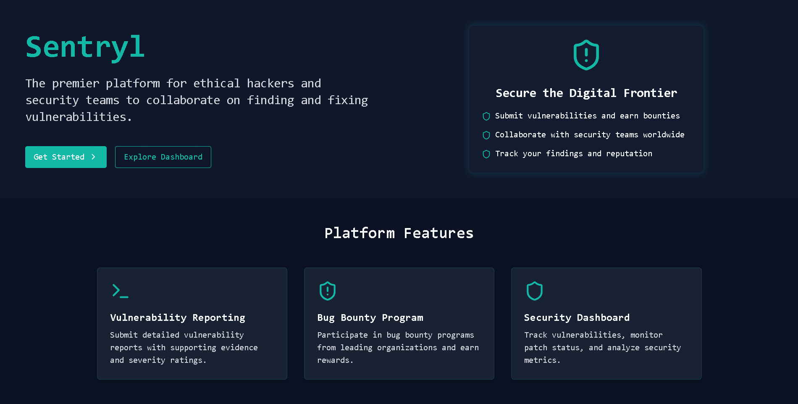

# Sentryl - Vulnerability Management Platform

<div align="center">
  <h1>Sentryl Cybersecurity Platform</h1>
  <p><strong>Advanced Vulnerability Management and Bug Bounty Platform</strong></p>
  
  <div class="live-demo-banner" style="margin: 30px 0;">
    <a href="https://sentryl.vercel.app" target="_blank">
      
    </a>
    <p style="margin-top: 8px;">
      <strong>Demo credential:</strong><br>
      Email: <code>demo@example.com</code> | Password: <code>demo123</code>
    </p>
  </div>
  
  <div>
    
    
    
    
    
  </div>
</div>
 
## Overview

Sentryl is a comprehensive vulnerability management and bug bounty platform designed to help organizations identify, track, and resolve security vulnerabilities efficiently. The platform bridges the gap between security researchers and organizations, streamlining the process of vulnerability reporting, verification, and remediation.

## Key Features

### For Security Researchers
- **Vulnerability Reporting**: Submit detailed reports with evidence, impact assessments, and remediation suggestions
- **Bug Bounty Programs**: Participate in programs and earn rewards for valid findings
- **Researcher Dashboard**: Track submission status, earnings, and reputation metrics
- **Secure Communications**: End-to-end encrypted messaging with security teams

### For Organizations
- **Security Dashboard**: Real-time overview of your security posture with actionable insights
- **Vulnerability Management**: Streamlined workflow for triaging, assigning, and resolving issues
- **Bug Bounty Program Management**: Configure and manage custom bounty programs
- **Analytics & Reporting**: Comprehensive reports on security trends and improvements

## Screenshots

<div align="center">
  <table>
    <tr>
      <td width="50%">
        
        <p align="center"><strong>Security Dashboard</strong></p>
      </td>
      <td width="50%">
        
        <p align="center"><strong>Landing Page</strong></p>
      </td>
    </tr>
  </table>
</div>

## Technology Stack

- **Frontend**: React 18, TypeScript, TailwindCSS
- **State Management**: React Context API
- **Authentication**: Supabase Auth
- **UI Components**: shadcn/ui
- **Build Tool**: Vite

## Project Structure

This project is organized as a frontend-only application using React, TypeScript, and Supabase.

```
sentryl/
├── frontend/           # All frontend code
│   ├── public/         # Static assets
│   ├── src/            # React components and application logic
│   │   ├── components/ # Reusable UI components
│   │   ├── context/    # React context providers
│   │   ├── hooks/      # Custom React hooks
│   │   ├── pages/      # Page components
│   │   ├── utils/      # Utility functions
│   │   └── ...
│   ├── package.json    # Frontend dependencies
│   └── ...
└── index.html          # Root index redirecting to frontend
```

## Getting Started

### Prerequisites

- Node.js (v18+)
- npm or yarn

### Installation

1. Clone the repository:
   ```bash
   git clone https://github.com/sachinskyte/Sentryl.git
   cd Sentryl
   ```

2. Install frontend dependencies:
   ```bash
   cd frontend
   npm install
   ```

3. Start the development server:
   ```bash
   npm run dev
   ```

4. Open your browser and navigate to `http://localhost:8080`

## Contributing

We welcome contributions from everyone. Here's how you can help:

1. Fork the repository
2. Create your feature branch (`git checkout -b feature/amazing-feature`)
3. Commit your changes (`git commit -m 'Add some amazing feature'`)
4. Push to the branch (`git push origin feature/amazing-feature`)
5. Open a Pull Request

### Development Guidelines

- Follow the existing code style and conventions
- Write clear, readable, and maintainable code
- Include comments where necessary
- Update documentation for any new features
- Test your changes thoroughly

## License

This project is licensed under the MIT License.

<div align="center">
  <p>© 2023 Sentryl. All rights reserved.</p>
  <p>
    <a href="https://sentryl.vercel.app">Website</a> •
    <a href="https://github.com/sachinskyte/Sentryl">GitHub</a>
  </p>
</div> 